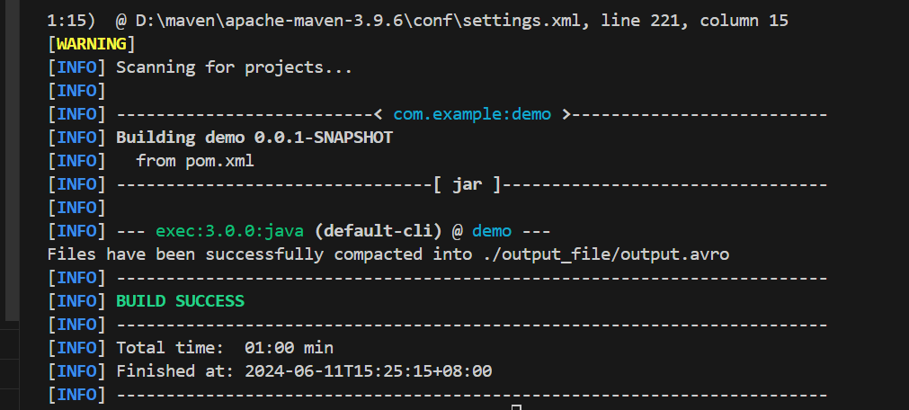
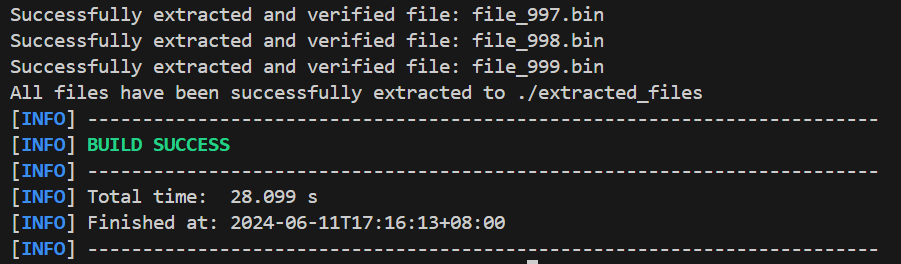

Ex. 1

1. I used team program from lab2(ex2, q1) and split the output into 1000 csv files. Code is in ex1.1.py.
   
2. The block size is 128 MB. I use the command "hdfs getconf -confKey dfs.blocksize" to get the block size. The result is 134217728 bytes which is 128 MB.

Ex. 2

1. 
Filecrush is a tool designed to merge numerous small files into fewer, larger files within Hadoop, addressing the inefficiency of managing many small files. To use Filecrush for our case, which is consolidating small files, we can follow these steps: First, install Filecrush. Second, upload all small CSV files to an HDFS directory. Third, execute the Filecrush command with options, specifying the input and output directories.

2/3. 
-Dfs.block.size=128000000: This option sets the HDFS block size to 128 MB. Setting this option ensures that the merged files fit within a manageable block size, optimizing storage and read/write performance.

--clone: This option indicates that the original small files should be preserved and moved to a subdirectory of the output directory. This is useful for keeping a backup of the original files.

--compress gzip: This option compresses the output files using Gzip compression. Compression reduces the storage space required for the merged files and can improve the performance of subsequent data processing tasks by reducing I/O operations.

--input-format text: This option specifies that the input files are in text format. CSV files are considered text files, so this option tells Filecrush to treat the input files as plain text.

--output-format sequence: This option specifies that the output files should be in Hadoop sequence file format. Sequence files are a binary format that is more efficient for large datasets, allowing for better performance when reading and writing large amounts of data.

I first installed Filecrash and used maven to created a project. Then I uploaded the small files to HDFS. Here is the command I used:

hadoop jar target/filecrush-2.2.2-SNAPSHOT.jar com.edwardcapriolo.filecrush.FileCrusher -Dfs.block.size=128000000 --clone --compress gzip --input-format text --output-format sequence input/csv_files/ output/merged_files/

The result is failure. Actually, none of the options worked. There were several java exceptions thrown. Because the project has not been touched since 2014, it doesn't work with Hadoop version 3.2.2.

Ex. 3

S3DistCp can be used to solve our problem, because it is optimized for efficient and parallel copying, or transferring large amounts of data. The --groupBy option allows us to group files based on a regular expression.

Suppose the files are all named from "file_1.csv" to "file_5000.csv". We can use the following command to merge the files:

s3-dist-cp --src s3://my-bucket/input/ --dest s3://my-bucket/output/ --groupBy=(file_.*\.csv)

--groupBy option is used to solve the problem, by specifying a regular expression that matches the file names. In this case, the regular expression "file_.*\.csv" matches all files named "file_1.csv" to "file_5000.csv". The files are grouped based on this pattern, and the output files are created accordingly.

From above, other options are added:

--src: The source directory in S3 containing the input files.

--dest: The destination directory in S3 for the output files.

Ex. 4

1. Snappy is a fast compression and decompression library developed by Google. Its primary design goal is very high speed and reasonable compression ratios, rather than maximizing compression. While it does not achieve the highest compression ratios, it provides a good balance between speed and space efficiency. Snappy is suitable for real-time or near-real-time applications due to its low latency characteristics.

Best-used cases:

Real-time Data Processing: Snappy is ideal for applications where speed is critical, such as stream processing and real-time analytics.

Big Data Frameworks: Snappy is widely used in Hadoop, Spark, and other big data frameworks where large volumes of data need to be processed quickly.

Log Processing: Due to its speed, Snappy is often used to compress log files, enabling faster ingestion and analysis.

2/3/4.

First, I use python program (ex4_0.py at ./ex_4/demo) to generate 5000 small binary files. Then, for question 2, I write schema.avsc (at ./ex_4/demo) by first defining the record and then setting the file content field and Checksum field. 

For question 3, I use avro-tools to compile the schema file to a java class. Then I read the directory containing small files and compact them into a single avro file. The command to run at ./ex_4/demo is:

mvn exec:java -D exec.mainClass="com.example.demo.CompactSmallFiles" -D exec.args="./binaryFiles ./output_file/output.avro ./schema.avsc"

For question 4, I write a Java class to read the Avro file created by question 3 and extract the small files while verifying the checksum. The process involves reading the schema file, creating a DatumReader and DataFileReader to read the Avro file, extracting the file contents into an output directory, and verifying the checksums to ensure data integrity. If there is a mismatch in the checksum, an error message is displayed. The command to run at ./ex_4/demo is:

mvn exec:java -D exec.mainClass="com.example.demo.ExtractSmallFiles" -D exec.args="./output_file/output.avro ./extracted_files ./schema.avsc"

