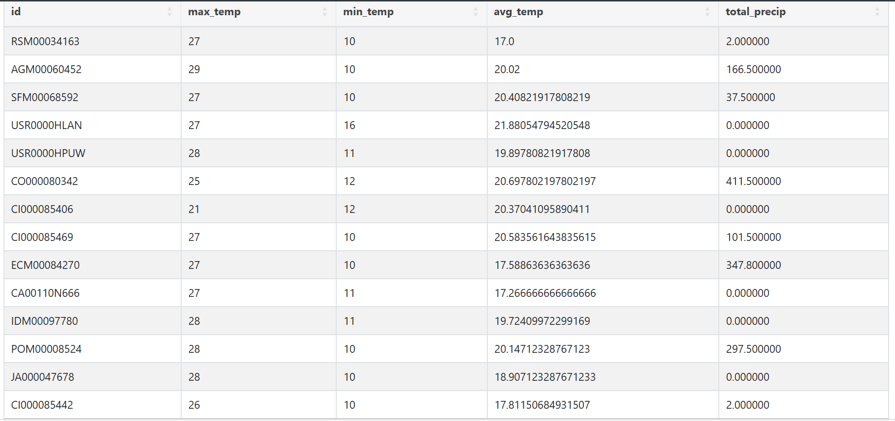
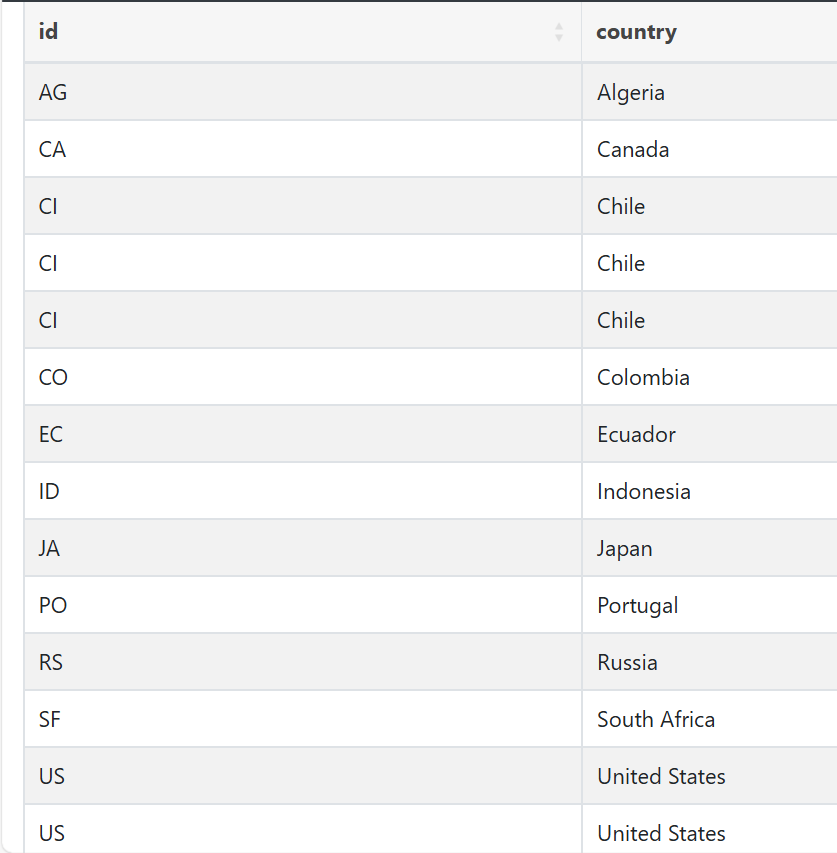
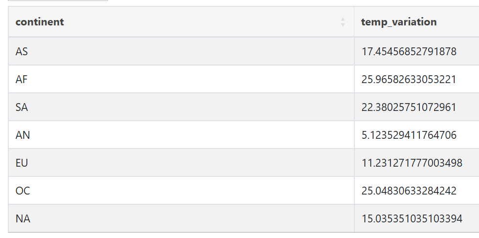
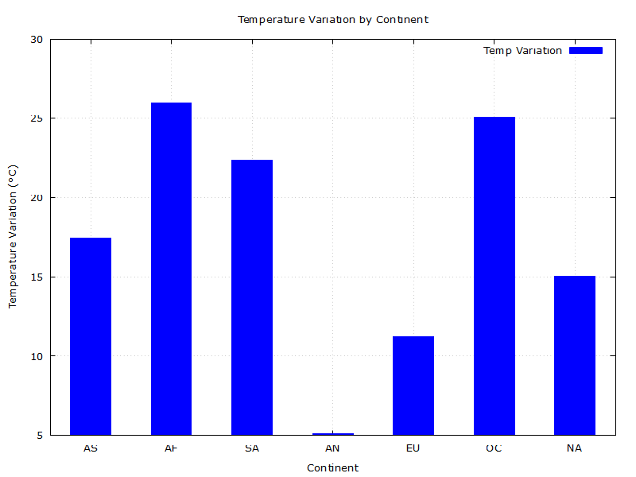
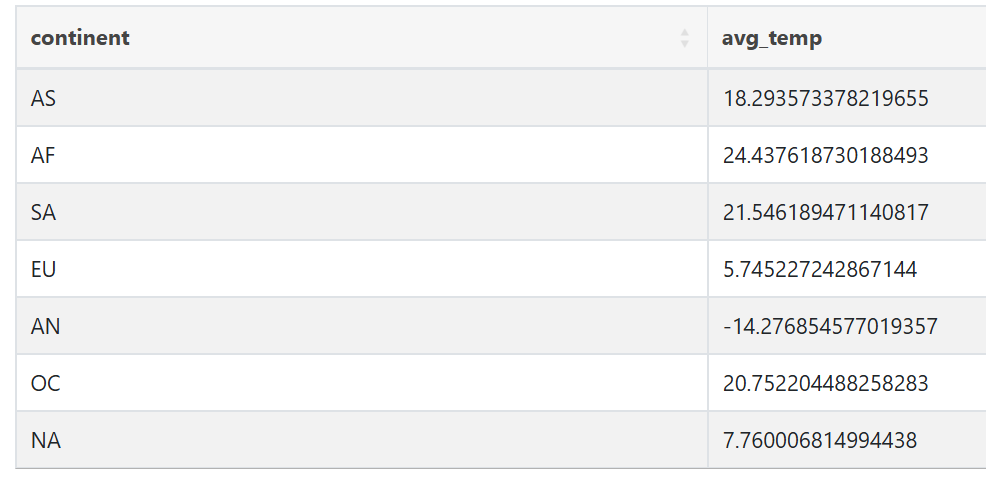
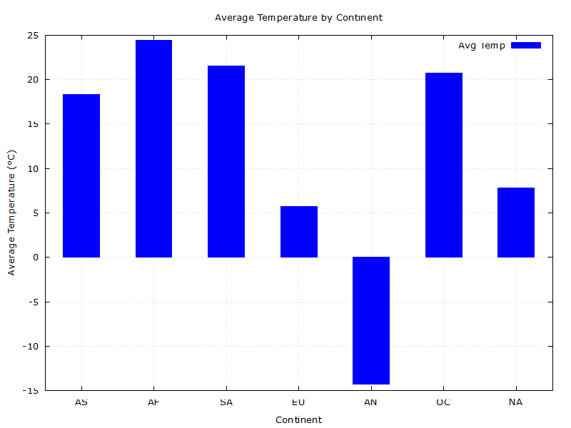

Ex. 1

1. Explain what is a Join operation, and describe its most common types.
   
    A Join operation in a database combines columns from two or more tables based on a related column between them. It is a fundamental operation used to retrieve data that is spread across multiple tables, thus allowing for more complex and comprehensive queries.
    
    The most common types of Join operations are:
    
    Inner Join: Returns records that have matching values in both tables. If there is no match, the row is not included in the result set.
    
    Left (Outer) Join: Returns all records from the left table and the matched records from the right table. If there is no match, the result is NULL on the side of the right table.
    
    Right (Outer) Join: Returns all records from the right table and the matched records from the left table. If there is no match, the result is NULL on the side of the left table.
    
    Full (Outer) Join: Returns records when there is a match in one of the tables. It returns all records from both tables, filling in NULLs where there is no match.
    
    Cross Join: Returns the Cartesian product of the two tables, meaning it will return all possible combinations of rows from the tables.

2. What is an aggregate operation?

    An Aggregate Operation in a database performs a calculation on a set of values and returns a single value. This operation is commonly used for summarizing data, such as computing averages, totals, counts, and other statistical metrics.
    
    Common aggregate functions include:
    
    COUNT(): Returns the number of rows in a set.
    
    SUM(): Returns the total sum of a numeric column.
    
    AVG(): Returns the average value of a numeric column.
    
    MIN(): Returns the minimum value in a set.
    
    MAX(): Returns the maximum value in a set.
    
    Aggregate operations are often used in combination with the GROUP BY clause to group the results based on one or more columns before performing the aggregate calculation.

3. See ex1-3.pdf

Ex. 2

1. Definition of "perfect weather":
   
   1) The average temperature is between 17 and 26 degrees Celsius.
   
   2) For daily temperature amplitude:

        The maximum temperature in a day is between 20 and 29 degrees Celsius.
        
        The minimum temperature is between 9 and 20 degrees Celsius.
   
   3) The total precipitation in a year is less than 500 mm.

2. SQL query to find the cities with perfect weather:
   
   ```sql
    CREATE TABLE dfs.data.`coun` AS
    SELECT 
    columns[0] AS id,
    columns[1] AS country
    FROM dfs.data.`ghcnd-countries.csv`;
    ```

    ```sql
    CREATE TABLE dfs.data.`Data2023` AS
    SELECT * FROM dfs.data.`2023.csv`;
    ```
    
    ```sql
    CREATE VIEW dfs.data.`weather` AS
    SELECT
    columns[0],
    MAX(CASE WHEN columns[2] = 'TMAX' THEN columns[3] ELSE NULL END) / 10.0 AS max_temp,
    MIN(CASE WHEN columns[2] = 'TMIN' THEN columns[3] ELSE NULL END) / 10.0 AS min_temp,
    AVG(CASE WHEN columns[2] = 'TAVG' THEN columns[3] ELSE NULL END) / 10.0 AS avg_temp,
    SUM(CASE WHEN columns[2] = 'PRCP' THEN columns[3] ELSE 0 END) / 10.0 AS total_precip
    FROM dfs.data.`Data2023`
    GROUP BY columns[0];
    ```
    
    ```sql
    CREATE VIEW dfs.data.`perfect` AS
    SELECT EXPR$0 AS id, max_temp, min_temp, avg_temp, total_precip
    FROM dfs.data.`weather`
    WHERE total_precip < 500
    AND max_temp BETWEEN 20 AND 29
    AND min_temp BETWEEN 9 AND 20
    AND avg_temp BETWEEN 17 AND 26
    LIMIT 20;
    ```
    
    
    ```sql
    SELECT c.id, c.country
    FROM dfs.data.`perfect` p
    JOIN dfs.data.`coun` c
    ON SUBSTR(p.id, 1, 2) = c.id;
    ```
    

    The perfect location can be Chile.

Ex. 3

1.
    ```sql
    CREATE TABLE dfs.data.`country_continent_new` AS
    SELECT 
    columns[0] AS country,
    columns[1] AS continent,
    columns[2] AS twoletter
    FROM dfs.data.`country_continent.csv`;
    ```
        
    ```sql
    CREATE VIEW dfs.data.`weather_continent_n` AS
    SELECT
    w.id AS id,
    cc.continent AS continent,
    w.max_temp AS max_temp,
    w.min_temp AS min_temp,
    w.avg_temp AS avg_temp,
    w.total_precip AS total_precip
    FROM dfs.data.`weather_new` w
    JOIN dfs.data.`country_continent_new` cc ON SUBSTR(w.id, 1, 2) = cc.twoletter
    ```
        
    ```sql
    CREATE TABLE dfs.tmp.`temp_variation_by_continent` AS
    SELECT continent, AVG(max_temp - min_temp) AS temp_variation
    FROM dfs.data.`weather_country_continent`
    GROUP BY continent;
    ```

    

    Use GNUplot.

    ./assets/plot_1.gp

    


2. Average temperature of each continent

    ```sql
    CREATE TABLE dfs.tmp.`avg_temp_by_continent` AS
    SELECT continent, AVG(avg_temp) AS avg_temp
    FROM dfs.data.`weather_continent_n`
    GROUP BY continent;
    ```


    

    ./assets/plot_2.gp

    
   


