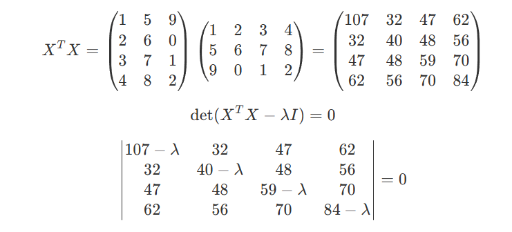

Ex. 1

1. How beneficial would it be to increase precision in the context of big data? What would be the gain of using double instead of float, or move on with multi-precision?
   
    Increasing precision in the context of big data has significant benefits. Using double precision instead of single precision can reduce rounding errors and improve the accuracy of computational results. For example, in financial calculations, the precision of decimal points can significantly impact the final results. Multi-precision calculations are suitable for scientific computations that require extremely high precision. Although these calculations are more computationally expensive, they can significantly reduce cumulative errors and positively impact numerical stability.

2. Generate 100 random 1000 by 100 matrices X and measure the total time.
    Code: refer to `ex1_2.m`

    Total time to compute SVD: 0.2492 seconds

    Total time to compute SVD of the transpose: 0.5370 seconds

    Total time to compute eigenvalue of $XX^T$: 5.2877 seconds

    Total time to compute eigenvalue of $X^TX$: 0.0750 seconds

3. Code: refer to `ex1_3.m`
   
   Accumulated Error of Eigenvalues over 10000 tests:
   
   Eigenvalue 1: Error = -113.39 + -81.2125i
   
   Eigenvalue 2: Error = 60.0744 + 309.408i
   
   Eigenvalue 3: Error = -139.694 + -384.334i
   
   Eigenvalue 4: Error = 152.04 + 300.716i
   
   Eigenvalue 5: Error = 40.9691 + -144.578i
   
   Accumulated Error of Singular Values over 10000 tests:
   
   Singular Value 1: Error = -9.03965e-08
   
   Singular Value 2: Error = -2.50865e-09
   
   Singular Value 3: Error = 3.80075e-09
   
   Singular Value 4: Error = -9.557e-10
   
   Singular Value 5: Error = 1.74709e-08
   
   From the variations, we can see that the eigenvalues have a significant error, while the singular values have a much smaller error. Eigenvalues are sensitive to perturbations, while singular values are more stable. 
   
   Comparing the running time:

   1) Computing the eigenvalues of $X^TX$ is faster than computing the eigenvalues of $XX^T$, because $X^TX$ is a 100 by 100 matrix, while $XX^T$ is a 1000 by 1000 matrix. The smaller matrix size results in faster computation.
   
   2) Computing the SVD of the transpose is slower than computing the SVD of the original matrix. Because complexity of a full SVD is O(mn^2), for a 1000 by 100 matrix, the original SVD is faster than the SVD of the transpose.
 
Ex. 2  Simple SVD calculations
   
   Calculation steps:
    

   Taking the square root, we can get the singular values of X:
    0.0000
    0.8722
    7.3173
    15.3524

Ex. 3
1. Explain how PCA can be of any help to Krystor?
   
   PCA can help Krystor by reducing the dimensionality of the dataset while retaining most of the variability present in the data. This reduction makes it easier to identify underlying patterns and relationships between the sensors' outputs and the hourly electric consumption. By transforming the original data into principal components, Krystor can focus on the most significant features of the dataset and potentially match the columns to their corresponding sensors more efficiently.

2.  How many columns of sensors1.csv are necessary to explain 90% of the data? Let n be that number.
    
    To determine the number of columns necessary to explain 90% of the data, we can perform PCA on the dataset and calculate the cumulative explained variance ratio. The cumulative explained variance ratio represents the proportion of the dataset's variance explained by each principal component. We can then select the number of principal components that explain at least 90% of the data. 

    Code: refer to ex3_2.py

    Result: To explain 90% of the variance, we need 3 principal components.

3.  Construct the linear model.

    Code: refer to ex3_3.py

    \[
    y = x_0 + \beta_1 p_1 + \beta_2 p_2 + \beta_3 p_3 + \epsilon
    \]

    where \(y\) is the hourly electric consumption, \(x0\) = 761.057 is the intercept, \(p_1\), \(p_2\), and \(p_3\) are the principal components, \(\beta_1\) = 8.26695, \(\beta_2\) = 2.99844, and \(\beta_3\) = -4.19890 are the coefficients, and \(\epsilon\) is the error term.

4. Determine if sensors2.csv also contains the output of the sensors in the electric circuit of Reapor Rich's new cinema.
   
   1) Load and standardize both sensors1.csv and sensors2.csv datasets.
   
   2) Perform PCA on both datasets, retaining components that explain 90% of the variance.
   
   3) Calculate the similarity matrix between the PCA components of the two datasets by computing the dot product of their components.
   
   4) Check if there are any components in sensors2.csv that are similar to those in sensors1.csv by verifying if the similarity values exceed a threshold of 0.9. If so, sensors2.csv likely contains similar sensor outputs.
   
   Code: refer to ex3_4.py

   Similarity Matrix:

    \[
    \begin{bmatrix}
    0.99293855 & -0.10232712 & -0.05618484 \\
    -0.10762126 & -0.98878197 & -0.10114921 \\
    0.04520038 & -0.10651417 & 0.9928833
    \end{bmatrix}
    \]

   Result: There are components in sensors2.csv that are similar to those in sensors1.csv.
